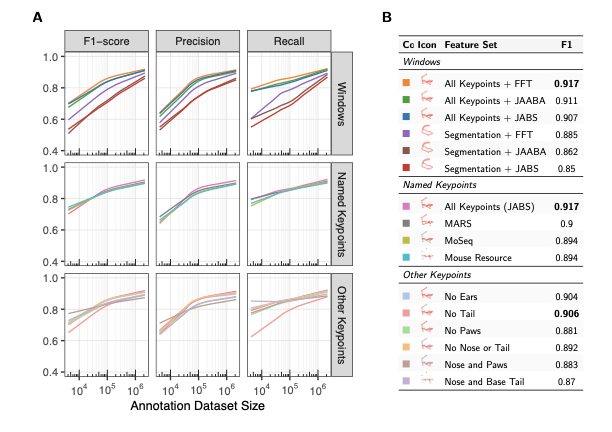

# Figure Generation Figure 4 Pipeline

This project generates a combined figure showing classifier performance across different feature sets and training dataset sizes. The figure consists of two panels: a performance metrics plot (Panel A) and a summary table with F1 scores (Panel B).

## Final Figure



*Figure: Classifier performance analysis. (A) Performance metrics across different feature sets and training dataset sizes, showing window-based features (top row), published keypoint sets (middle row), and ablation keypoint sets (bottom row). (B) Summary table of F1 scores for all feature sets with color coding matching the plot.*

**Note:** The high-resolution PDF version is available as `combined_figure_final.pdf`.

## Quick Start

### Prerequisites

**Python Environment:**
```bash
python3 -m venv venv
source venv/bin/activate
pip install -r requirements.txt
```

**R Packages:**
```r
install.packages(c("ggplot2", "dplyr", "scales", "yaml"))
```

### Generate the Figure

**Option 1: Run Complete Pipeline (Recommended)**
```bash
./scripts/run_pipeline.sh
```

**Option 2: Run Steps Manually**
```bash
# Step 1: Export GAM fits
cd scripts
source ../venv/bin/activate
python export_plotnine_fits.py
cd ..

# Step 2: Generate plot
cd scripts
Rscript plot_from_plotnine_csv.R
cd ..

# Step 3: Generate LaTeX and compile
cd scripts
python generate_latex_from_config.py
pdflatex -output-directory=.. combined_figure_final.tex
cd ..
```

## Pipeline Overview

The pipeline consists of three steps:

1. **Export plotnine GAM fits** (Python) → `data/plotnine_gam_predictions.csv`
   - Uses plotnine's GAM smoothing to fit curves
   - Extracts fitted values and exports to CSV

2. **Generate plot from fits** (R) → `fig_combined_from_plotnine.pdf`
   - Reads fitted values from Step 1
   - Creates ggplot2 figure with faceting
   - Saves as PDF, PNG, and SVG

3. **Combine plot and table** (LaTeX) → `combined_figure_final.pdf`
   - Generates LaTeX from `config.yaml`
   - Combines plot (Panel A) and table (Panel B)
   - Compiles to final PDF

## Project Structure

```
project_root/
├── scripts/          # All executable scripts
├── data/             # Input and intermediate data files
├── log/              # Build artifacts and logs
├── icons/            # PDF icons for table
├── old_files/        # Archived files
├── config.yaml       # Configuration file (edit this!)
└── (output files)    # Generated figures in root
```

## Configuration

**All settings are in `config.yaml`** - edit this file to customize:
- Plot dimensions and fonts
- Colors and plot group order
- Panel layout and table content
- File paths

See `CONFIG.md` for detailed configuration guide.

## Output Files

- `data/plotnine_gam_predictions.csv` - Intermediate: GAM fitted values
- `fig_combined_from_plotnine.pdf` - Plot panel (Panel A)
- `combined_figure_final.pdf` - **Final output**: Complete figure

## Troubleshooting

**Python script fails:**
- Ensure virtual environment is activated
- Install required packages: `pip install -r requirements.txt`

**R script fails:**
- Install required packages: `install.packages(c("ggplot2", "dplyr", "scales", "yaml"))`
- Check that `config.yaml` exists

**LaTeX compilation fails:**
- Ensure all required LaTeX packages are installed
- Check that `fig_combined_from_plotnine.pdf` exists
- Check that `icons/` directory contains required PDF files

**Configuration errors:**
- Validate YAML: `python -c "import yaml; yaml.safe_load(open('config.yaml'))"`

## Documentation

- **`CONFIG.md`** - Complete configuration guide with examples
- **`config.yaml`** - All configurable parameters with inline comments
